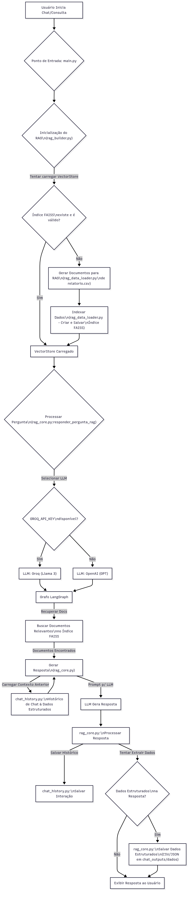

# Poke RPA Pipeline & AI Chat

Este projeto é uma solução completa para extração, transformação e análise de dados de Pokémon, combinada com uma interface de chat interativa baseada em IA para consultar os dados em linguagem natural.

O sistema utiliza um pipeline de ETL para buscar dados da PokeAPI, processá-los e gerar relatórios. Em seguida, indexa essas informações para que um modelo de linguagem (LLM) possa responder a perguntas complexas, funcionando como um assistente de análise de dados.

---

## ✨ Funcionalidades Principais

- **Pipeline de ETL Automatizado**: Extrai, transforma e carrega dados de Pokémon de forma eficiente.
- **Geração de Relatórios**: Cria automaticamente relatórios em formato CSV e visualizações gráficas.
- **Cache Inteligente**: Armazena dados já buscados para acelerar execuções futuras.
- **Chat Interativo com IA (RAG)**: Converse com seus dados! Faça perguntas como "quantos pokémon do tipo fogo existem?" ou "liste os 5 pokémon com maior ataque".
- **Suporte a Múltiplos LLMs**: Compatível com Groq (Llama 3) e OpenAI (GPT), com fallback automático.
- **Containerização com Docker**: Ambiente de execução padronizado, leve e fácil de implantar.

---

## 🚀 Tecnologias Utilizadas

- **Backend**: Python 3.12
- **Bibliotecas Principais**:
  - `pandas`: Manipulação e análise de dados.
  - `requests`: Requisições HTTP para a PokeAPI.
  - `matplotlib` & `seaborn`: Geração de gráficos.
  - `langchain` & `langgraph`: Orquestração do pipeline de IA (RAG).
  - `faiss-cpu`: Armazenamento e busca de vetores para o RAG.
  - `python-dotenv`: Gerenciamento de variáveis de ambiente.
- **Containerização**: Docker

---

## 📋 Pré-requisitos

Antes de começar, garanta que você tenha os seguintes softwares instalados:

- [Python 3.12+](https://www.python.org/downloads/)
- [Docker](https://www.docker.com/get-started)
- [Git](https://git-scm.com/downloads)

---


## ⚙️ Configuração Rápida

1. **Clone o repositório:**
   ```bash
   git clone <URL_DO_SEU_REPOSITORIO>
   cd Onfly-RPA
   ```

2. **Crie o arquivo de ambiente:**
   - Copie o arquivo `.env.example` para `.env` na raiz do projeto:
     ```bash
     cp .env.example .env
     # ou no Windows:
     copy .env.example .env
     ```
   - Preencha suas chaves de API no `.env`:
     ```env
     GROQ_API_KEY="sua_chave_groq_aqui"
     OPENAI_API_KEY="sua_chave_openai_aqui"
     ```
   - Você pode obter as chaves em:
     - https://console.groq.com/keys
     - https://platform.openai.com/account/api-keys

3. **Garanta que as pastas `logs`, `chat_outputs` e `data` existam**
   - Elas já são criadas automaticamente, mas se necessário, crie manualmente:
     ```bash
     mkdir logs chat_outputs data
     ```

4. **Execute tudo com Docker Compose:**
   ```bash
   docker-compose up --build
   ```
   - O backend (API) estará em http://localhost:8001
   - O frontend estará em http://localhost

5. **Acesse no navegador:**
   - Frontend: http://localhost
   - API: http://localhost:8001/docs (Swagger UI)

6. **Dicas:**
   - Para reiniciar, use `docker-compose down` e depois `docker-compose up --build`.
   - Se quiser resetar dados, apague o conteúdo das pastas `logs`, `chat_outputs` e `data`.
   - Se aparecer erro de CORS, certifique-se de que o backend foi reiniciado após editar `.env` ou código.

---

---

## ⚡ Como Executar

<<<<<<< HEAD
Existem duas maneiras de executar o projeto: via Docker (recomendado) ou localmente.

### 🐳 Via Docker (Recomendado)

Esta é a forma mais simples e segura de executar a aplicação, pois todo o ambiente já está configurado dentro do contêiner, utilizando o `docker-compose` para orquestração.

1.  **Garanta que o `.env` esteja na raiz do projeto:**
    Certifique-se de que o arquivo `.env` com suas chaves de API (conforme a seção "Configuração") esteja na raiz do diretório do projeto.

2.  **Construa e inicie os serviços com Docker Compose:**
    No terminal, na raiz do projeto, execute o comando para construir a imagem e iniciar o contêiner:
    ```bash
    docker compose up --build -d
    ```
    Este comando:
    - `up`: Inicia os serviços definidos no `docker-compose.yml`.
    - `--build`: Constrói a imagem se ela ainda não existir ou se houver alterações no `Dockerfile`.
    - `-d`: Executa o contêiner em segundo plano (detached mode).


3.  **Execute o Pipeline de ETL (dentro do contêiner):**
    Com os containers rodando, execute o pipeline de ETL usando:
    ```bash
    docker-compose exec backend python main.py pipeline
    ```
    Isso executa o mesmo que `python main.py pipeline` faria localmente, mas dentro do container backend.


4.  **Inicie o Chat Interativo (dentro do contêiner):**
    Para abrir o chat interativo no terminal, siga este passo a passo:

    1. Abra um novo terminal na raiz do projeto (deixe o terminal do `docker-compose up` rodando em paralelo).
    2. Execute o comando abaixo para acessar o chat interativo dentro do container backend:
       ```bash
       docker-compose exec backend python main.py chat
       ```
    3. Converse normalmente com a IA pelo terminal.
    4. Para sair do chat, digite `sair` ou `exit`.

    > **Dica:** Você pode executar o pipeline de ETL ou o chat quantas vezes quiser, sempre usando o comando `docker-compose exec backend ...` para rodar comandos interativos dentro do container.

5.  **Parar e remover os serviços (opcional):
**Quando terminar de usar, você pode parar e remover os contêineres, redes e volumes criados pelo `docker-compose` (exceto os volumes persistentes `data`, `logs` e `chat_outputs` que você criou manualmente para a persistência):
    ```bash
    docker compose down
    ```

6.  **Inicie o Frontend (Chat Interativo via Web) via Docker:**
    Se você configurou o serviço de frontend no `docker-compose.yml`, o frontend será iniciado automaticamente junto com o backend quando você executar `docker compose up --build -d`. Você pode então acessar o chat interativo no seu navegador através do endereço `http://localhost:5173`.
=======
>>>>>>> e3c6aa1f23c0abc6d731808c1d0338b2de616cb6

### 🐍 Localmente (Sem Docker)

1.  **Crie e ative um ambiente virtual:**
    ```bash
    # Windows
    python -m venv venv
    .\venv\Scripts\activate

    # Linux / macOS
    python3 -m venv venv
    source venv/bin/activate
    ```

2.  **Instale as dependências:**
    ```bash
    pip install -r requirements.txt
    ```

3.  **Execute o Pipeline de ETL:**
    ```bash
    python main.py pipeline
    ```

4.  **Inicie o Chat Interativo:**
    ```bash
    python main.py chat
    ```


---

## 📂 Estrutura do Projeto

```
.
├── api.py             # API RESTful para interação com o ETL e RAG.
├── chat_outputs/      # Saídas geradas pelo chat (histórico, dados, gráficos).
│   ├── dados/         # Dados extraídos e transformados (e.g., CSV).
│   └── historico.txt  # Histórico das interações do chat.
├── data/              # Dados brutos, processados e índices do FAISS.
│   └── indice_faiss/  # Índice FAISS para o sistema RAG.
│       ├── index.faiss
│       └── index.pkl
├── docs/              # Documentação do projeto.
│   └── fluxo_de_execucao_modulos.md
├── 
├── logs/              # Arquivos de log da aplicação Python.
├── main.py            # Ponto de entrada da aplicação (CLI).
├── README.md          # Documentação principal do projeto.
├── requirements.txt   # Dependências Python do projeto.
└── src/               # Código-fonte principal da aplicação Python.
    ├── config/        # Configurações globais.
    │   └── settings.py
    ├── etl/           # Módulos para Extração, Transformação e Carga de dados.
    │   ├── extractor.py
    │   ├── pipeline.py
    │   ├── reporter.py
    │   └── transformer.py
    ├── rag/           # Módulos do sistema RAG (Retrieval Augmented Generation).
    │   ├── chat_history.py
    │   ├── rag_core.py
    │   └── rag_data_loader.py
    ├── utils/         # Utilitários diversos.
    │   ├── cache.py
    │   └── logger.py
    ├── rag.py         # Lógica principal do RAG (pode ser refatorado em rag_core.py).
    └── rag_builder.py # Construtor/inicializador do sistema RAG.
```

## 📚 Documentação Detalhada

Para uma análise aprofundada da arquitetura, fluxo de execução dos módulos e detalhes de implementação de cada componente, consulte o nosso documento de fluxo de execução:

- **[Fluxo de Execução Detalhado dos Módulos](docs/fluxo_de_execucao_modulos.md)**


### Fluxo de Execução dos Módulos


https://www.mermaidchart.com/app/projects/c34e6cdc-58d1-4fb7-9a9d-907fdbc382e7/diagrams/f1a30f46-5e6b-4afd-9918-2663ff8f3bec/version/v0.1/edit